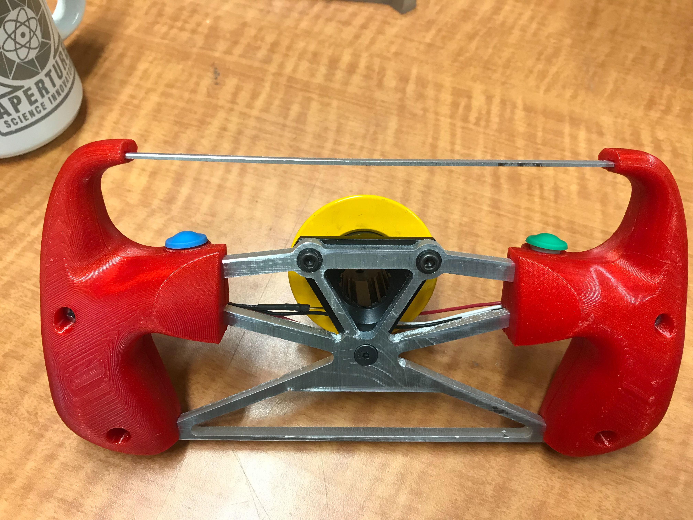
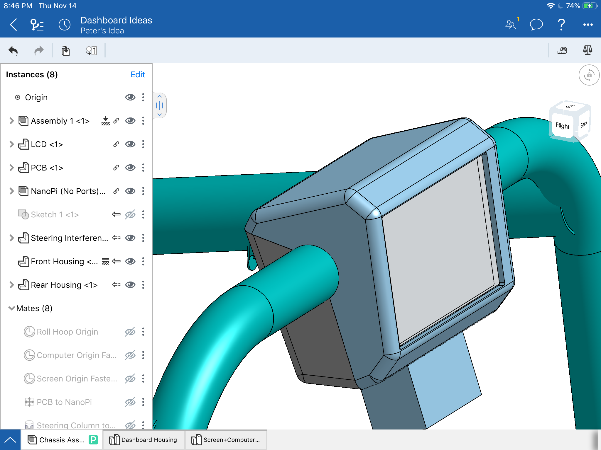
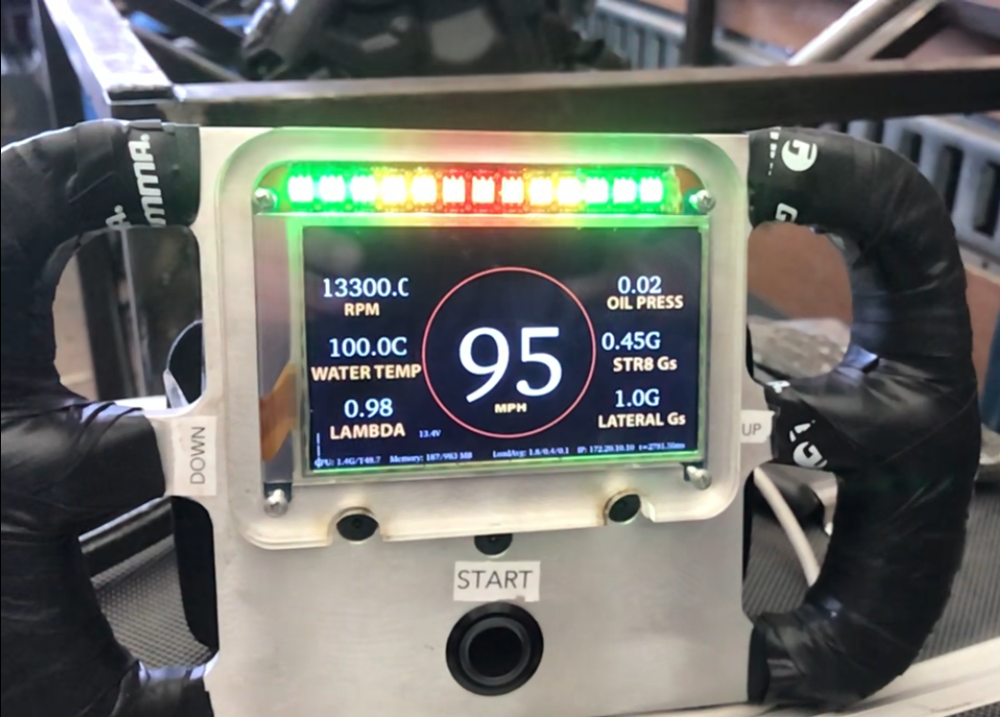

# FSAE Apollo

This repo houses code for the Brown FSAE Driver Feedback system.

A new design is in the pipeline ;) 
<p float="left">
        
        
</p>

2019 Design:




## Project Structure

```
fsae-apollo/            
│   master_run.sh               # Instantiates screens for both the display code and the data parsing code 
│
└───hardware                    # 
│   │   leds.py                 # LED Class
│   │   master.py               # Parses data, controls to LEDs, draws display
│   │   params.py               # Parameters
│   └───arduino/canbus_middleman        # 
│   │   │   canbus_middleman.ino        # Interprets CANBUS and retransmits over serial
│
└───display                     # Lots of random files that handle the display code. 
│   │   main.qrc                # We should triage this to figure out what we actually need
│   │   mainwidget.cpp          
│   │   mainwidget.h
│   └───backgrounds             # Image files for the display
```

## Compile Qt 

To compile the Qt package, you will need to run the following: 

```
cd build/
# Generate the Makefile 
/usr/local/Trolltech/Qt-5.10.0-nexell32-sdk/bin/qmake ../display/QtE-Demo.pro 
# idk, it just works
make -j4
```

## NanoPi setup

The NanoPi is running a Xenial image installed into eMMC from the (friendlyarm wiki)[http://wiki.friendlyarm.com/wiki/index.php/NanoPi_S2#Boot_from_SD_Card].

wpa_supplicant.conf
```sh
update_config=1
country=CN

network={
        ssid="Rhodedendron"
        psk="********" //Old Faithful
}
```

rc.local
```sh
exec 1>/tmp/rc.local.log 2>&1  # send stdout and stderr from rc.local to a log file
set -x

. /usr/bin/setqt5env
/usr/bin/lcd2usb_print "CPU: {{CPU}}" "Mem: {{MEM}}" "IP: {{IP}}" "LoadAvg: {{LOADAVG}}" 2>&1 > /dev/null&
##/opt/QtE-Demo/run.sh&

bash /root/fsae-apollo/master_run.sh &
```
/root/.bashrc
```sh
. /usr/bin/setqt5env

source ~/fsae-apollo/venv/bin/activate
cd ~
```

## Install fsae-apollo 
You will need Python 3.7 installed to run fsae-apollo. 

Set up your working environment: 
``` sh
git clone https://github.com/peterhuson/fsae-apollo.git && cd fsae-apollo
python3 -m venv venv
```

Activate your virtual environment, and install required packages: 
``` sh 
source venv/bin/activate
pip install -r requirements.txt
```

Deactivate the virtual environment using: 
``` sh
deactivate
```
